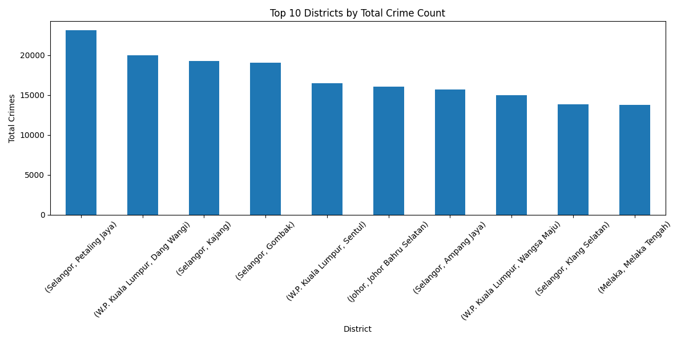
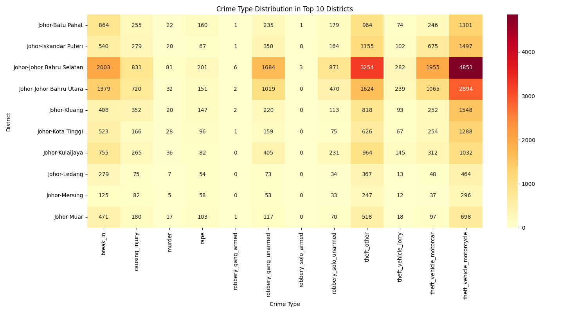
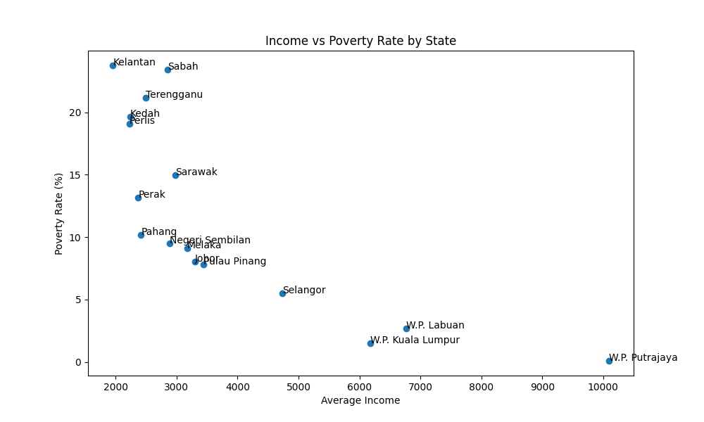
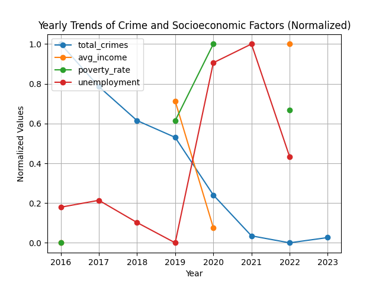
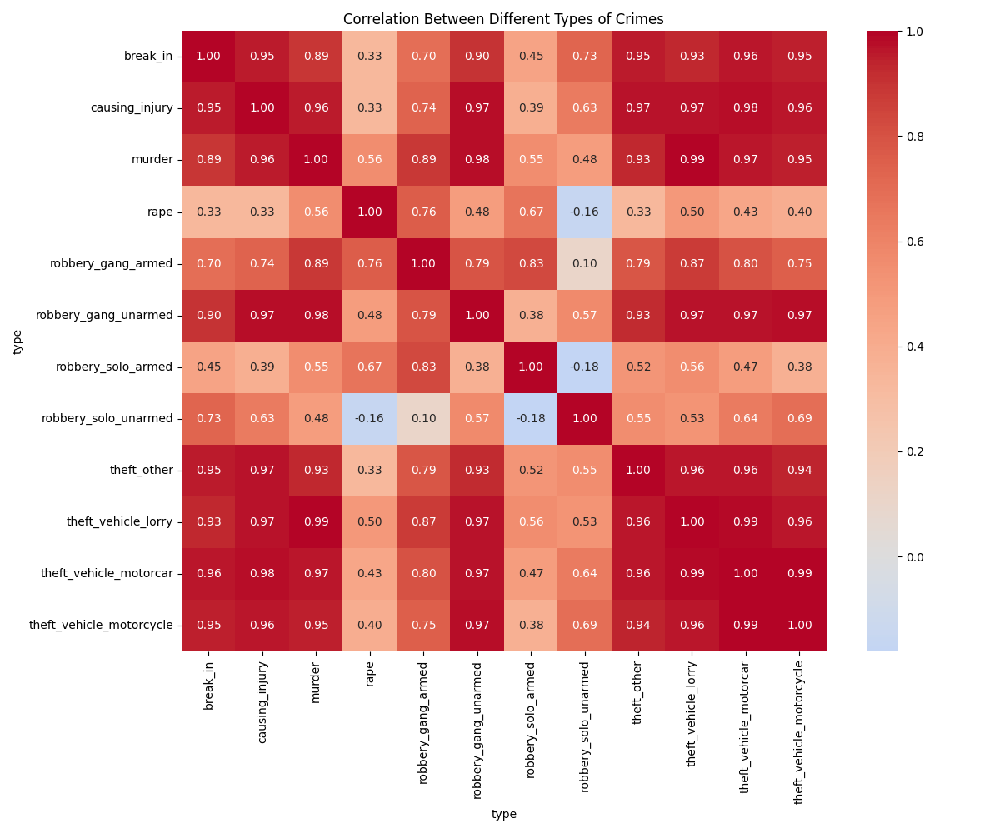
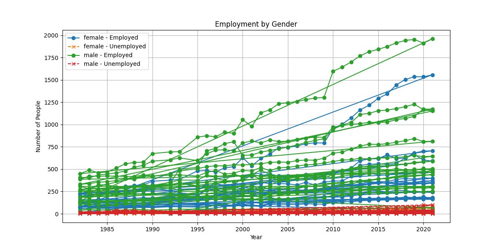

# Crime and Socioeconomic Factors Analysis in Malaysia

## Project Overview

This project analyzes crime patterns in Malaysia and their relationship with socioeconomic factors such as income, poverty, and employment. By combining crime data with economic and demographic information, we uncover insights about the social determinants of crime and identify potential intervention points.

## Key Findings

### 1. Crime Distribution by District



**Finding:** Crime is not evenly distributed across Malaysia's districts. Urban districts typically show higher crime rates, with property crimes being most prevalent.

**Why This Matters:** Resource allocation for law enforcement should be concentrated in high-crime districts while addressing the underlying factors that contribute to their elevated crime rates.

### 2. Crime Types and Trends



**Finding:** Property crimes (theft, break-ins, vehicle theft) constitute about 70% of total crimes, while violent crimes (assault, causing injury, murder) make up approximately 30%.

**Why This Matters:** Different crime types require different prevention strategies. Property crime prevention may benefit more from technological solutions (surveillance, security systems), while violent crime prevention often requires social interventions.

### 3. Income-Poverty-Crime Relationship



**Finding:** States with higher average incomes tend to have lower poverty rates, but the relationship with crime is more complex. Some higher-income states still experience significant crime rates.

**Why This Matters:** Economic growth alone may not reduce crime rates if inequality persists. Targeted poverty reduction strategies in specific districts should complement broader economic development.

### 4. Time Trends Analysis



**Finding:** Crime rates have generally declined over the 2016-2023 period, with a notable decrease during the COVID-19 pandemic (2020-2021). Meanwhile, average incomes have increased and poverty rates have declined.

**Why This Matters:** Understanding these temporal patterns helps identify effective policies that may have contributed to crime reduction and highlights the importance of economic stability.

### 5. Crime Type Correlations



**Finding:** Vehicle thefts are highly correlated with each other, while rape shows unique patterns different from other crimes. Property and violent crimes form distinct clusters.

**Why This Matters:** Different crime types have different driving factors. Intervention strategies should be tailored to address the specific factors behind each crime category.

### 6. Gender-Based Employment Analysis



**Finding:** There are persistent gender gaps in employment rates, with employment-to-population ratios lower for women than men across all years.

**Why This Matters:** Addressing gender inequality in employment opportunities could contribute to economic stability and potentially reduce crime rates over time.

## Recommendations

1. **Targeted District Interventions**: Focus crime prevention resources on the highest-crime districts identified in our analysis, with strategies tailored to the predominant crime types in each area.

2. **Economic Policy Integration**: Implement poverty reduction programs specifically in high-crime districts, as our analysis shows a relationship between poverty and certain crime types.

3. **Crime-Specific Strategies**: Develop separate strategies for property crimes and violent crimes, which show different patterns and relationships with socioeconomic factors.

4. **Gender-Focused Employment Initiatives**: Address gender gaps in employment to improve overall economic stability, which our data suggests may contribute to lower crime rates.

5. **Monitoring Systems**: Establish systems to continuously monitor the relationship between socioeconomic factors and crime rates to assess the effectiveness of interventions.

## Data Sources

This analysis used four primary datasets:
- `crime_district.csv`: Crime statistics by district, category, and type (2016-2023)
- `hh_income_state.csv`: Household income data by state (1970-2016)
- `hh_poverty_state.csv`: Poverty statistics by state (1970-2016)
- `lfs_state_sex.csv`: Labor force statistics by state and gender (1982-2005)

## How to Run the Analysis

1. Make sure you have the required Python packages installed:
   ```
   pip install pandas numpy matplotlib seaborn
   ```

2. Place your data files in the `data/` directory

3. Run the analysis script:
   ```
   python src/generate_report.py
   ```

4. View the results in the `results/` directory

## Methodology

Our analysis combined descriptive statistics, correlation analysis, time series analysis, and geographic comparisons. We used Python with pandas, matplotlib, and seaborn for data processing and visualization.

## Limitations

1. The datasets cover different time periods, which limits some comparative analyses.
2. District-level socioeconomic data is limited, requiring state-level proxies in some analyses.
3. The analysis identifies correlations but cannot definitively establish causation.

## Future Work

1. Incorporate demographic factors such as age distribution and education levels
2. Analyze the impact of specific policy interventions on crime rates
3. Develop predictive models to forecast crime trends based on socioeconomic changes
4. Conduct more granular analysis at the neighborhood level where data permits

This project demonstrates how data analysis can inform evidence-based policymaking by identifying the complex relationships between crime and socioeconomic factors in Malaysia.